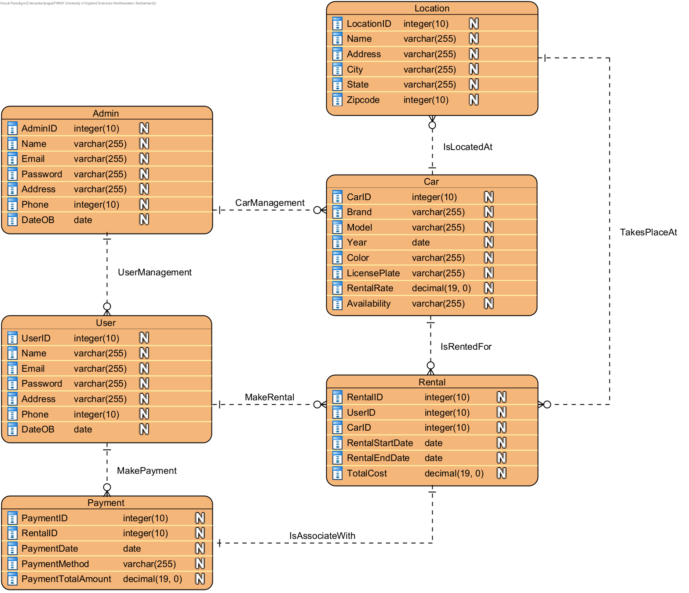

# Car_Rental_Project_Internet_Technology
The fundamental concept of this group project is to create a functional Web application to practise and use the knowledge we have learned from the lectures and e-lectures.

#### Contents:
- [Analysis](#analysis)
  - [Scenario Ideation](#scenario-ideation)
  - [User Stories](#user-stories)
  - [Use Case](#use-case)
- [Design](#design)
  - [Prototype Design](#prototype-design)
  - [Domain Design](#domain-design)
  - [Business Logic](#business-logic)
- [Implementation](#implementation)
  - [Backend Technology](#backend-technology)
  - [Frontend Technology](#frontend-technology)
- [Project Management](#project-management)
  - [Roles](#roles)
  - [Milestones](#milestones)

## Analysis
In our analysis, we specify the following sections to ensure a comprehensive understanding of the requirements and functionalities of our web application. 

### Scenario Ideation

Car_Rental (Car_Rental_Project_Internet_Technology) is a tool allowing the car rental manager (Role: Admin) and the customers (Role: User) to manage car rental operations.

#### Scenario 1: Admin Overview
------------------------------------------------------------
Descripiton: The admin logs in to see all the business data.

Steps:
1. Admin navigates to the login page.
2. Admin enters the credentials (AdminID & password)
3. System verifies the credentials.
4. Admin can navigate to the business data section.
5. Admin logs out. 

#### Scenario 2: Admin Management
------------------------------------------------------------
Description: The admin wants to maintain the DB, such as car inventory (add or delete), car location changes, and car availability. 

Steps: 
1. Admin navigates to the login page.
2. Admin enters the credentials (AdminID & password)
3. System verifies the credentials.
4. Admin can navigate to the management section.
5. Admin can CRUD inventory, locations, availability.
6. Admin logs out. 

#### Scenario 3: User Registration
------------------------------------------------------------
Description: A new user wants to register an account on the car rental website. 

Steps: 
1. User navigates to the website's registration page.
2. User fills out the registration form with their personal information.
3. User submits the registration form.
4. System validates the information and creates a new user account.
5. User receives a confirmation message and is redirected to the login page.

#### Scenario 4: Searching for Available Cars
------------------------------------------------------------
Description: A registered user wants to search for available cars for rental. 

Steps: 
1. User logs in to the car rental website.
2. User navigates to the search page.
3. User selects the desired location, rental dates, and any other search criteria.
4. User submits the search request.
5. System retrieves and displays a list of available cars matching the search criteria. 

#### Scenario 5: Renting a Car
------------------------------------------------------------
Description: A registered user wants to rent a car from the available options. 

Steps: 
1. User selects a car from the list of available cars.
2. User specifies the rental dates and any additional rental options.
3. User confirms the rental request.
4. System processes the rental request, calculates the total cost, and checks for availability.
5. User makes the payment to confirm the rental.
6. System generates a rental confirmation and updates the car's availability status. 

### User Stories

1. As a new user, I want to register an account to access the car rental services.
2. As a registered user, I want to search for available cars based on my preferred location and dates.
3. As a registered user, I want to rent a car by selecting from the available options and specifying rental details. 

### Use Case

#### Use Case 1: Admin Overview
------------------------------------------------------------
Actors:         Admin, System

Description:    Allows the admin to get an overview of the business data.

Precondition:   Admin navigates to the login page.

Postcondition:  Could get an overview of the current data.

Main Flow: 
1. Admin logs in.
2. System validates the credentials.
3. Admin navigates to the overview page. 

Alternate Flows: 
Invalid input: If the admin provides invalid credentials, system displays error messages.

#### Use Case 2: Admin Management
------------------------------------------------------------
Actors: Admin, System 

Description: Allows the admin to manage the platform. 

Precondition: Admin navigates to the login page. 

Postcondition: Desired CUD operations are executed successfully.  

Main Flow:
1. Admin logs in.
2. System validates the credentials.
3. Admin navigates to the management page.
4. Admin create, update, delete desired data. 

Alternate Flows: 
Invalid input: If the admin provides invalid information, system displays error messages. 

#### Use Case 3: User Registration
------------------------------------------------------------
Actors: User, System 

Description: Allows a user to create a new account on the car rental website. 

Precondition: User navigates to the registration page. 

Postcondition: User account is created successfully. 

Main Flow:
1. User provides personal information.
2. System validates the information.
3. System creates a new user account. 

Alternate Flows: 
Invalid input: If the user provides invalid information, system displays error messages. 

#### Use Case 4: Search for Available Cars
------------------------------------------------------------
Actors: User, System 

Description: Allows a user to search for available cars based on specified criteria. 

Precondition: User is logged in and navigates to the search page. 

Postcondition: User views a list of available cars matching the search criteria. 

Main Flow: 
1. User specifies search criteria.
2. System retrieves and displays available cars.

Alternate Flows: 
No cars available: If no cars match the search criteria, system displays a message.

#### Use Case 5: Rent a Car
------------------------------------------------------------
Actors: User, System 

Description: Allows a user to rent a car from the available options. 

Precondition: User has selected a car for rental. 

Postcondition: User completes the rental process and receives confirmation. 

Main Flow:
1. User selects a car and specifies rental details.
2. System checks availability and calculates total cost.
3. User makes the payment.
4. System generates a rental confirmation. 

Alternate Flows: 
Payment failure: If the payment fails, system prompts the user to try again. 

### Design
> ***

### Wireframe
> ***

### Prototype Design
> ***

### Domain Design

We created an Entity-Relationship Model in Visual Paradigm.

#### Entities

Admin: Represents the administrators of the website.
User: Represents individuals who interact with the website.
Car: Represents the vehicles available for rental.
Rental Represents a rental transaction.
Payment: Represents a payment transaction associated with a rental.
Location: Represents the rental locations where cars are available.

#### Relationships

##### Admin – User (UserManagement)
One-to-Many relationship indicates that an admin can edit multiple users.

##### Admin – Car (CarManagement)
One-to-Many relationship indicates that an admin can edit multiple cars.

##### User – Rental (MakeRental)
One-to-Many relationship indicating that a user can make multiple rentals, but each rental is associated with only one user.

##### User – Payment(MakePayment)
One-to-Many relationship indicates that a user can make multiple payments, but each payment is made by only one user.

##### Car – Rental (IsRentedFor)
One-to-Many relationship indicating that a car can be rented multiple times, but each rental is associated with only one car.

##### Rental – Payment (IsAssociatedWith)
One-to-One relationship indicating that each rental has exactly one payment associated with it.

##### Rental – Location (TakesPlaceAt)
Many-to-One relationship: Many rentals can take place ate the same rental location, but each rental only takes place at  only one location.

##### Location – Car (IsLocatedAt)
One-to-Many relationship indicating that a location can have multiple cars available for rental, but each car is located at only one location.

#### Model

### Business Logic 
> ***

## Implementation
> ***

### Backend Technology
> ***

### Frontend Technology
> ***

## Execution
> ***

## Project Management
> ***

### Roles
- developer: Nicole Kaufmann
- developer: Lea Gauch

### Milestones
1. **Analysis**: Scenario ideation, use case analysis and user story writing.
2. **Prototype Design**: Creation of wireframe and prototype.
3. **Domain Design**: Definition of domain model.
4. **Business Logic and API Design**: Definition of business logic and API.
5. **Data and API Implementation**: Implementation of data access and business logic layers, and API.
6. **Security and Frontend Implementation**: Integration of security framework and frontend realisation.
7. (optional) **Deployment**: Deployment of Web application on cloud infrastructure.

#### Maintainer
- Nicole Kaufmann
- Lea Gauch

#### License
- [Apache License, Version 2.0](blob/master/LICENSE)
